# Sequence Diagrams

## Projects

### Create project
<details>
<summary>Diagram</summary>

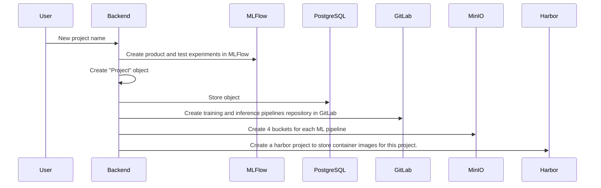
</details>

### Delete project
<details>
<summary>Diagram</summary>

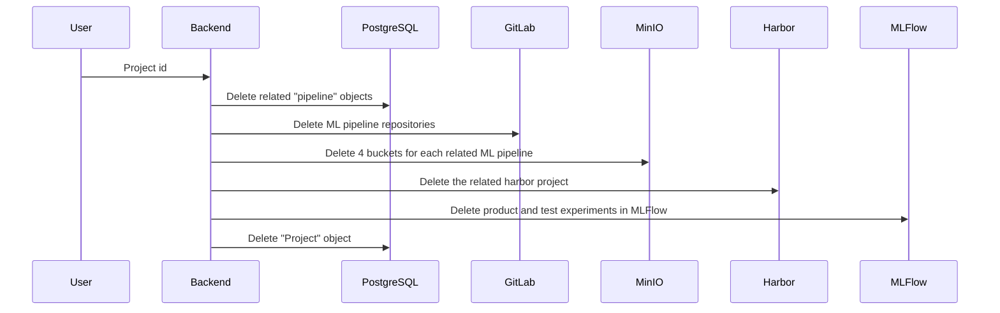
</details>

## Pipelines

### Get a pipeline by Id
<details>
<summary>Diagram</summary>

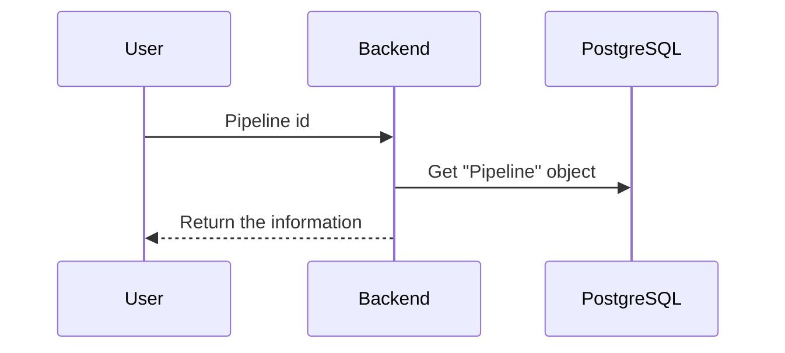
</details>

### Get a pipeline by project id and type
<details>
<summary>Diagram</summary>

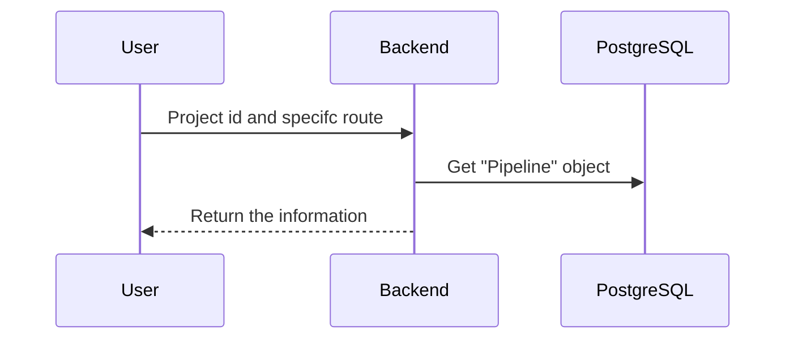
</details>

## PipelineJobs

### Create pipelineJob
<details>
<summary>Diagram</summary>

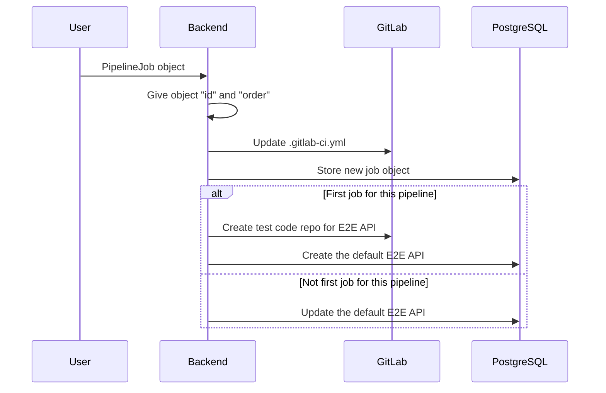
</details>

### Get pipelineJob
<details>
<summary>Diagram</summary>

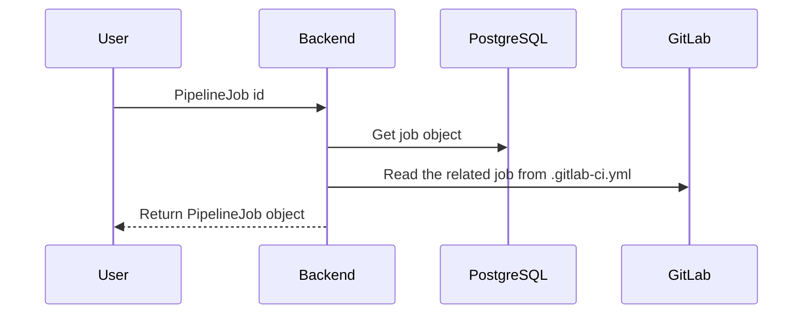
</details>

### Update pipelineJob
<details>
<summary>Diagram</summary>

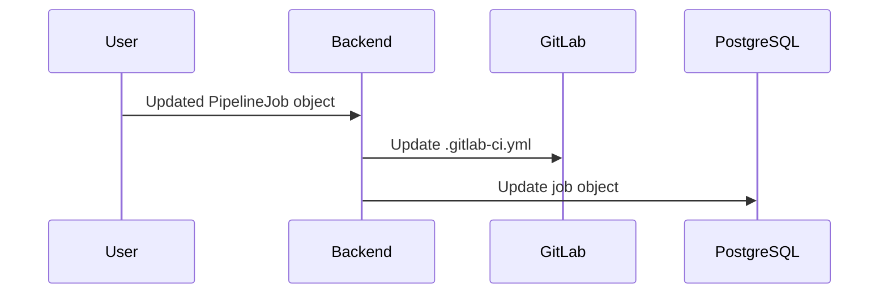
</details>

### Delete pipelineJob
<details>
<summary>Diagram</summary>

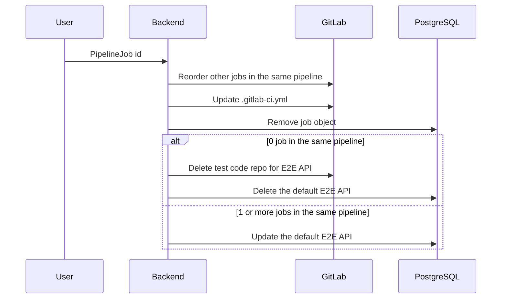
</details>

## PipelieAPIs

### Create pipelineAPI
<details>
<summary>Diagram</summary>

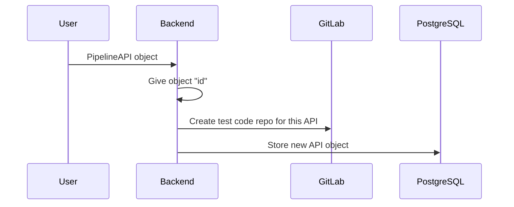
</details>

### Get pipelineAPI
<details>
<summary>Diagram</summary>

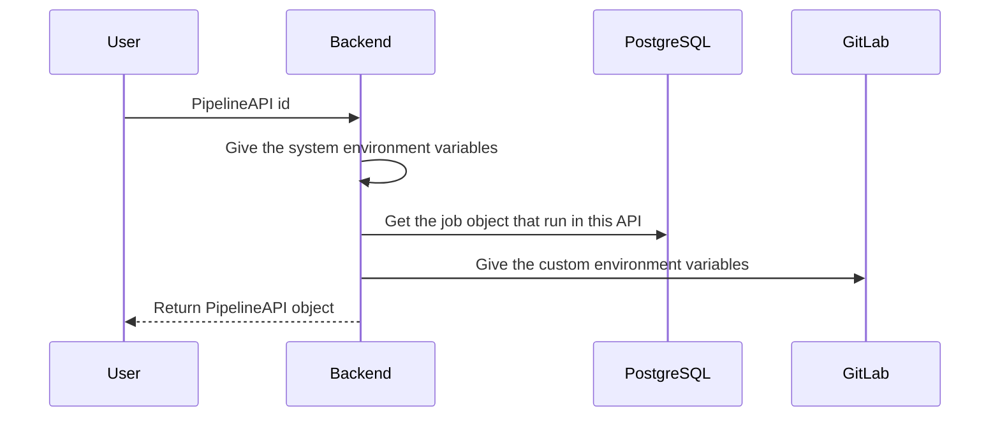
</details>

### Update pipelineAPI
<details>
<summary>Diagram</summary>

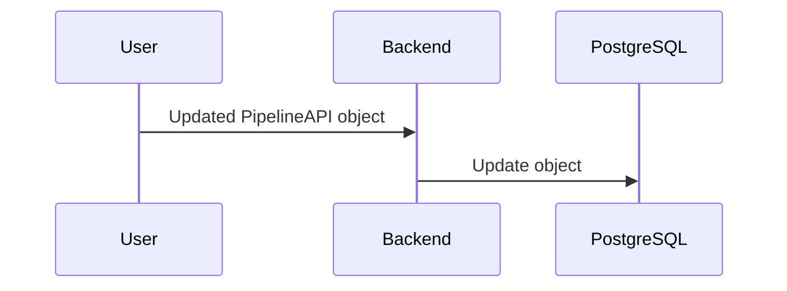
</details>

### Delete pipelineAPI
<details>
<summary>Diagram</summary>

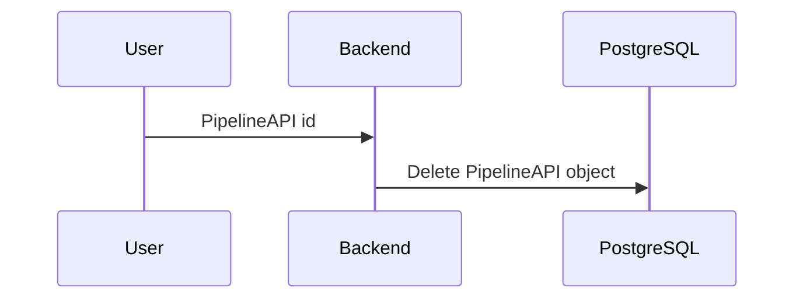
</details>

### Run pipelineAPI
<details>
<summary>Diagram</summary>

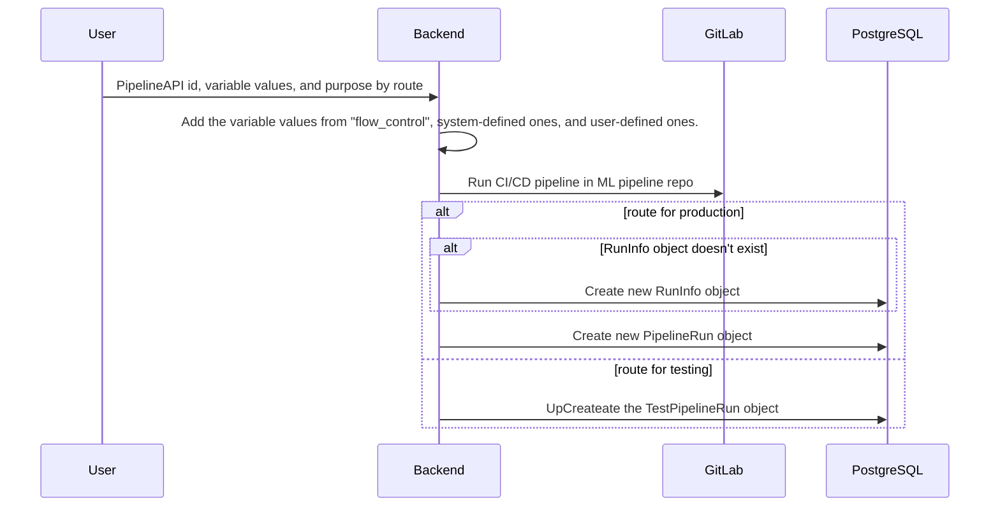
</details>

### Test pipelineAPI
<details>
<summary>Diagram</summary>

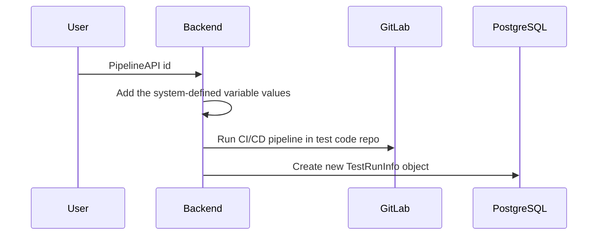
</details>

## Runs

### Get RunInfo
<details>
<summary>Diagram</summary>

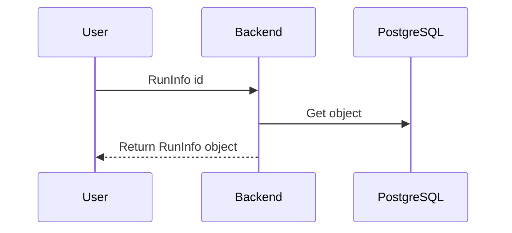
</details>

### Get PipelineRun
<details>
<summary>Diagram</summary>

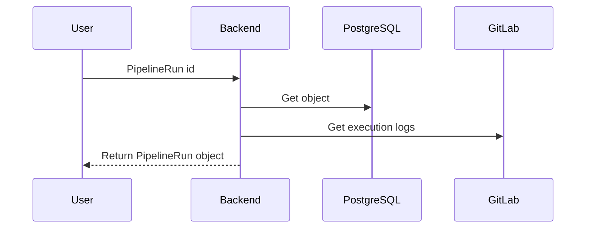
</details>

### Get running status of PipelineRun
<details>
<summary>Diagram</summary>

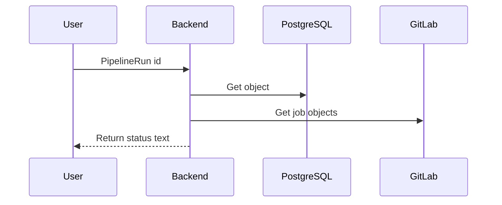
</details>

### Get job information of PipelineRun
<details>
<summary>Diagram</summary>

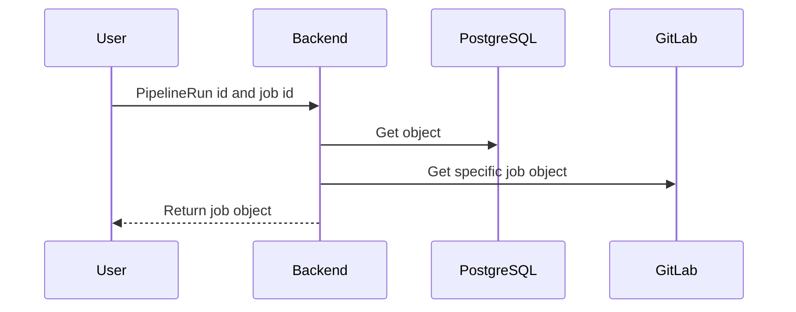
</details>

## TestRuns

### Get TestRunInfo
<details>
<summary>Diagram</summary>

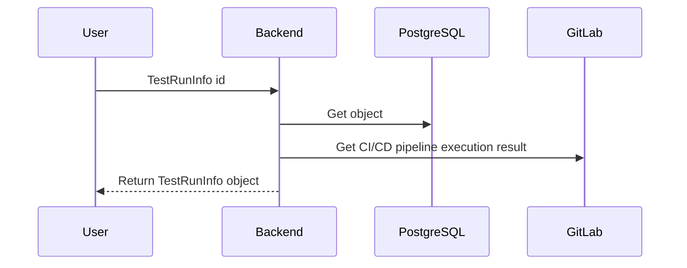
</details>

### Get TestPipelineRun
<details>
<summary>Diagram</summary>

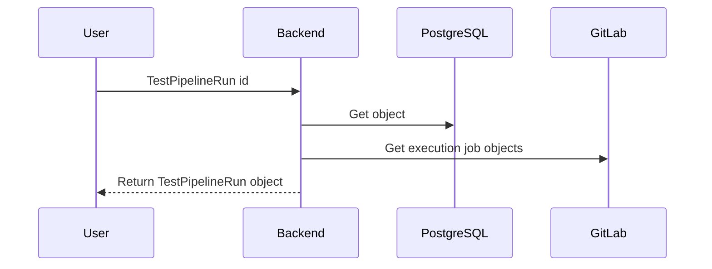
</details>

### Get running status of TestPipelineRun
<details>
<summary>Diagram</summary>

```mermaid
sequenceDiagram
    User->>Backend: TestPipelineRun id
    Backend->>PostgreSQL: Get object
    Backend->>GitLab: Get execution status 
    Backend-->>User: Return status text
```
</details>

### Get job information of TestPipelineRun
<details>
<summary>Diagram</summary>

```mermaid
sequenceDiagram
    User->>Backend: TestPipelineRun id and job id
    Backend->>PostgreSQL: Get object 
    Backend->>GitLab: Get specific job object
    Backend-->>User: Return job object
```
</details>

## Storage

### Upload file object
<details>
<summary>Diagram</summary>

```mermaid
sequenceDiagram
    User->>Backend: Bucket name and object name
    Backend->>MinIO: Get object upload url 
    Backend-->>User: Return upload url
```
</details>

### Get file objects
<details>
<summary>Diagram</summary>

```mermaid
sequenceDiagram
    User->>Backend: Bucket name and folder name
    Backend->>MinIO: Get object list 
    Backend-->>User: Return file and folder list
```
</details>

### Download file object
<details>
<summary>Diagram</summary>

```mermaid
sequenceDiagram
    User->>Backend: Bucket name and object name
    Backend->>MinIO: Get object download url 
    Backend-->>User: Return download url
```
</details>

### Delete file object
<details>
<summary>Diagram</summary>

```mermaid
sequenceDiagram
    User->>Backend: Bucket name and object name
    Backend->>MinIO: Remove the object
```
</details>

### Download folder
<details>
<summary>Diagram</summary>

```mermaid
sequenceDiagram
    User->>Backend: Bucket name and folder name
    Backend->>MinIO: Get each object in the folder
    Backend->>Backend: Package each object into a zip file
    Backend-->>User: Return zip file
```
</details>

### Delete folder
<details>
<summary>Diagram</summary>

```mermaid
sequenceDiagram
    User->>Backend: Bucket name and folder name
    Backend->>MinIO: Get each object in the folder
    Backend->>MinIO: Delete each object in the folder
```
</details>