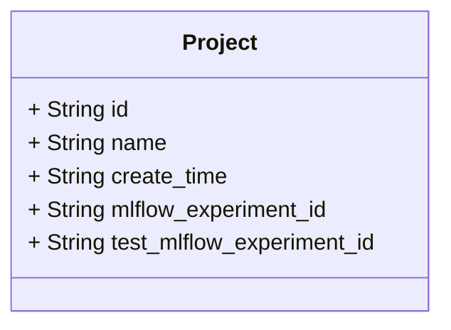
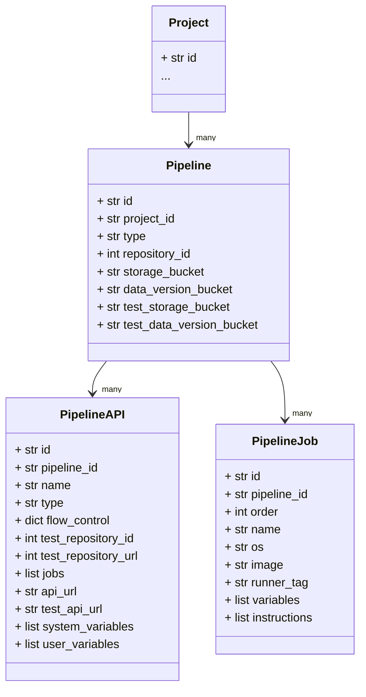
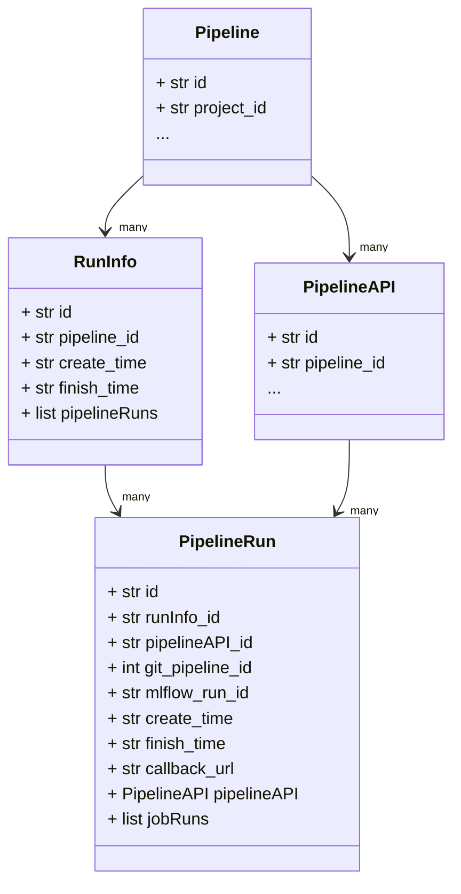
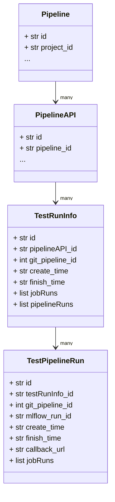

# Schema
- Manage all data structures for this project.
- Here the data is based on the data from PostgreSQL and mixed with the data in other tools.

## File structure
### base.py
- Provide the type validation for attributes in each class.

### project.py

- "Project" manages storage spaces and pipelines for different purpose.
- "mlflow_id" and "test_mlflow_id" are for product usage and testing usage separately.

### pipeline.py

#### Pipeline
- "Pipeline" means ML pipelines.
    - "project_id" indicates which "Project" this pipeline belongs to.
    - "type" indicates the usage of this pipeline either "model training" or "model inference".
    - Each "Pipeline" record the GitLab repository for this ML pipeline and MinIO storage sapces for raw data and data version.

#### PipelineAPI
- "PipelineAPI" derive from a "Pipeline". 
    - "pipeline_id" indicates which "Pipeline" this API derives from.
    - "type" indicates this pipeline either "E2E" or "custom Sub-API".
    - Record the environment variables in "system_variables" and "user_variables".
    - "flow_control" indicates whether each component in the pipeline runs or not in this API.
    - "test_repository_id" and "test_repository_url" record the testing repository for this API.

#### PipelineJob
- "PipelineJob" is one job(component) of a pipeline.
    - "order" indicates the order of execution in the pipeline.
    - "os" indicates the based OS for this job.
    - "image" indicates the based container image for this job when it runs on Linux only.
    - "runner_tag" indicates the job would assign to which GitLab runner to execute it.

### run.py
- The system will record them in "RunInfo" and "PipelineRun" while running the APIs of pipeline.

#### RunInfo
- "pipeline_id" indicates this record is related to the specific "Pipeline".
- "create_time" and "finish_time" store the execution time for the full run.
- The different APIs store their execution records in the same "Run_Info" by the same variable "RUN_ID" value.

#### PipelineRun
- PipelineRun is a execution record of PipelineAPI.
    - "create_time" and "finish_time" store the execution time for this API.
    - "pipelineAPI_id" indicates this record is related to the specific "PipelineAPI".
    - You can get the pipeline execution logs by "git_pipeline_id" from GitLab.

### test_run.py
- The system will record them in "TestRunInfo" and "TestPipelineRun" while testing the APIs of the pipeline.

#### TestRunInfo
- pipelineAPI_id indicates this record is related to the specific "PipelineAPI".
- "create_time" and "finish_time" store the execution time for the full run.
- The results of different test cases for an API record in the same "TestRunInfo" by the same variable "RUN_ID" value.
- The system executes the CI/CD pipeline in test code repository while testing an API. We use "git_pipeline_id" and "jobRuns" to get the execution logs of it.

#### TestPipelineRun
- "TestPipelineRun" is a execution record of "PipelineAPI" while testing.
    - testRunInfo_id indicates this record is related to the specific "TestRunInfo".
    - "create_time" and "finish_time" store the execution time for the full run.
    - You can get the pipeline execution logs by "git_pipeline_id" from GitLab.