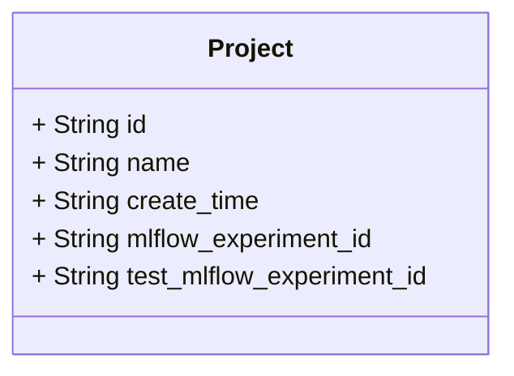
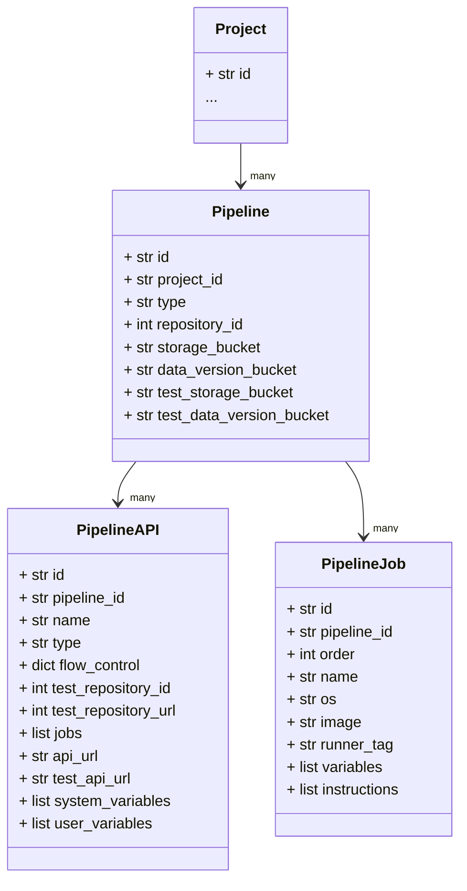
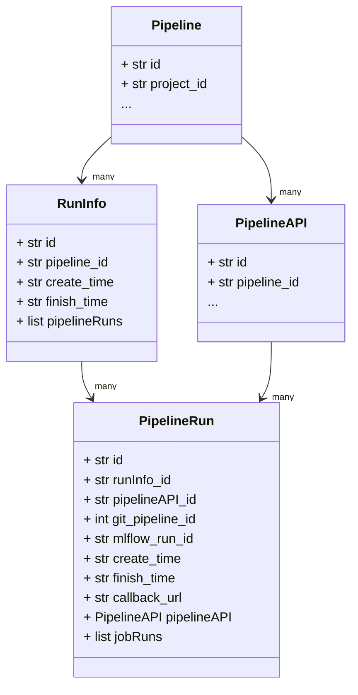
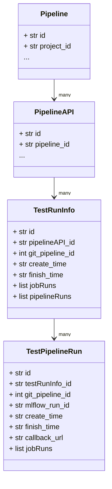

# Schema
- 管理此專案用到的資料結構
- 這裡的資料是以 PostgreSQL 中的資料為基礎，再加上其他外部工具中的資料整合而成

## File structure
### base.py
- 提供每個類別對屬性進行型別驗證功能

### project.py

- Project 管理系統中不同目的的管道與儲存空間
- mlflow_id 和 test_mlflow_id 分別提供給生產使用與測試使用

### pipeline.py

#### Pipeline
- Pipeline 表示機器學習管道
    - project_id 決定這個管道屬於哪個 Project
    - type 表示這個管道的用途是"模型訓練"或是"模型推論"
    - 每個 pipeline 會記錄對應的 GitLab 專案以及使用的 MinIO 資料儲存與資料版本控制空間

#### PipelineAPI
- PipelineAPI 是從管道衍生出來的
    - pipeline_id 表示這個 API 是從哪個 pipeline 衍生出來
    - type 表示這個管道是"端到端"或是"自定義子管道"
    - system_variables 和 user_variables 存放環境變數
    - 透過 flow_control 來記錄每個元件是否要執行
    - test_repository_id 和 test_repository_url 記錄測試這個 PipelineAPI 的程式碼儲存庫

#### PipelineJob
- PipelineJob 是管道中的一個工作(元件)
    - order 代表這個工作在管道中的執行順序
    - os 代表這個工作運行在哪個作業系統
    - image 代表這個工作運行在哪個容器映像檔上，只有在 os 是 Linux 時才需要設定
    - runner_tag 代表這個工作會被分配到特定的 GitLab runner 中運行

### run.py
- 當管道 API 開始執行時，就會透過 RunInfo 跟 PipelineRun 進行記錄

#### RunInfo
- pipeline_id 代表這個紀錄與哪個管道相關
- create_time 與 finish_time 儲存執行的時間
- 執行 API 時設定變數 RUN_ID 為相同的值，多個 PipelineRun 共用一個 RunInfo

#### PipelineRun
- PipelineRun 代表每一筆管道API的執行紀錄
    - create_time 與 finish_time 管道執行時間
    - 紀錄執行哪個 pipelineAPI
    - 並根據 git_pipeline_id 從 GitLab 取得管道執行紀錄

### test_run.py
- 對管道 API 進行測試時，就會透過 TestRunInfo 跟 TestPipelineRun 進行記錄

#### TestRunInfo
- pipelineAPI_id 代表這個紀錄與哪個管道 API 相關
- create_time 與 finish_time 儲存執行的時間
- 對於單一 API 的不同測試案例結果可以通過設定相同的 RUN_ID，讓這些測試紀錄共用一個 TestRunInfo
- 當測試一個 API 時，我們會通過測試程式碼儲存庫的 CI/CD 管道執行，所以需要 git_pipeline_id 與 jobRuns 去取得管道執行紀錄

#### TestPipelineRun
- TestPipelineRun 代表測試時每一筆管道API的執行紀錄
    - testRunInfo_id 表示與哪個測試紀錄有關
    - create_time 與 finish_time 管道執行時間
    - 根據 git_pipeline_id 從 GitLab 取得管道執行紀錄